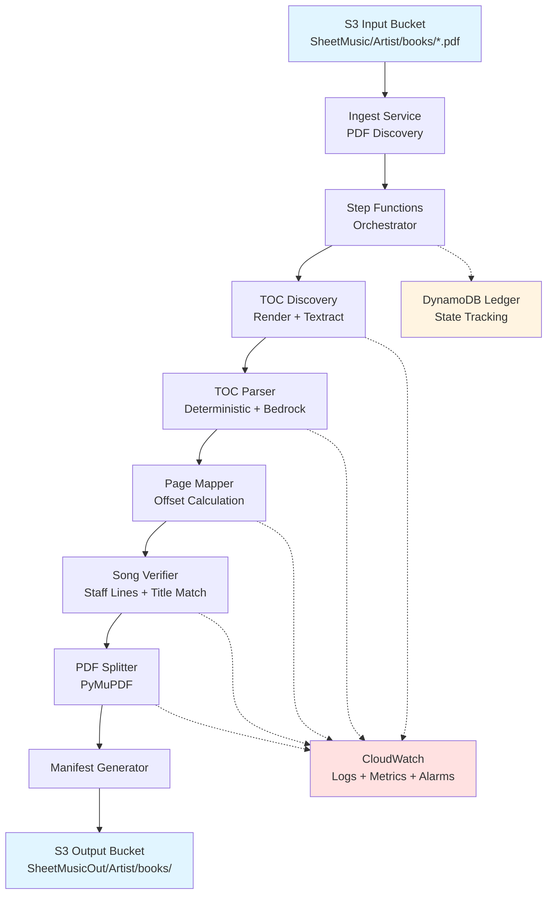

# ORIGINAL DESIGN DOCUMENT (Kiro AI Agent)

> **Note**: This is the original design document created by the Kiro AI agent during initial system development. It represents the planned architecture and design philosophy. For the current implemented state, see [PROJECT_CHECKPOINT_2026-01-31.md](../../PROJECT_CHECKPOINT_2026-01-31.md).
>
> **Date**: Original design phase
> **Status**: Historical reference - implementation complete

---

# Design Document: SheetMusic Book Splitter

## Overview

The SheetMusic Book Splitter is a production-grade AWS-native pipeline that automatically processes songbook PDFs stored in S3, extracts their Table of Contents, and splits them into individual per-song PDF files. The system is designed to handle 500+ PDFs with minimal human intervention while maintaining strict cost controls (~$1,000 budget), comprehensive auditability, and high reliability.

The pipeline follows a multi-stage architecture orchestrated by AWS Step Functions, with each stage performing a specific function: PDF discovery, TOC extraction, page mapping, song verification, and PDF splitting. The system is designed to be resumable, idempotent, and debuggable, with all intermediate artifacts saved to S3 and processing state tracked in DynamoDB.

### Key Design Principles

1. **Automation-First**: Minimize manual intervention through intelligent fallback strategies
2. **Cost-Conscious**: Track and limit AWS service usage with guardrails and alarms
3. **Auditability**: Save all intermediate artifacts and produce detailed manifests
4. **Robustness**: Handle edge cases (weird fonts, mixed content, various artists) gracefully
5. **Resumability**: Support idempotent operations and state tracking for failed executions

## Architecture

### High-Level Architecture



### Deployment Architecture

The system uses a hybrid compute model:
- **Lambda Functions**: For lightweight orchestration tasks (Ingest Service, Manifest Generator)
- **ECS Fargate**: For compute-intensive tasks (TOC Discovery, PDF Splitting)
- **Step Functions**: For workflow orchestration and state management

### Data Flow

1. **Ingest Phase**: Scan S3 input bucket, discover PDFs, create Step Functions executions
2. **TOC Discovery Phase**: Render first N pages, run Textract, score for TOC-likeness
3. **TOC Parsing Phase**: Extract structured TOC data using deterministic parser with Bedrock fallback
4. **Page Mapping Phase**: Sample TOC entries, calculate offset between printed pages and PDF indices
5. **Verification Phase**: Verify song start pages using staff line detection and title matching
6. **Splitting Phase**: Extract page ranges and create individual song PDFs
7. **Manifest Phase**: Generate manifest.json with metadata and write to S3

## Components and Interfaces

### 1. Ingest Service

**Purpose**: Discover PDFs in S3 and initiate Step Functions executions

**Implementation**: AWS Lambda (Python 3.12)

**Interface**:
```python
def lambda_handler(event, context):
    """
    Triggered by: CloudWatch Events (scheduled) or manual invocation
    Returns: List of Step Functions execution ARNs
    """
    pass

def discover_pdfs(bucket: str, prefix: str) -> List[S3Object]:
    """
    Scan S3 bucket for PDFs matching pattern
    Returns: List of S3 objects with bucket, key, artist, book_name
    """
    pass

def start_step_function(pdf_metadata: dict) -> str:
    """
    Start Step Functions execution for a single PDF
    Returns: Execution ARN
    """
    pass

def check_already_processed(book_id: str) -> bool:
    """
    Query DynamoDB ledger to check if book was already processed
    Returns: True if already processed successfully
    """
    pass
```

**Key Behaviors**:
- Scans S3 prefix `SheetMusic/<Artist>/books/*.pdf` recursively
- Extracts artist and book name from S3 path
- Checks DynamoDB ledger for idempotency
- Creates one Step Functions execution per PDF
- Handles pagination for large S3 listings

### 2. TOC Discovery Service

**Purpose**: Locate and extract text from Table of Contents pages

**Implementation**: ECS Fargate task (Python 3.12 + PyMuPDF + boto3)

**Interface**:
```python
def discover_toc(pdf_s3_uri: str, max_pages: int = 20) -> TOCDiscoveryResult:
    """
    Find TOC pages in PDF
    Returns: TOCDiscoveryResult with page numbers and extracted text
    """
    pass

def render_pages(pdf_path: str, page_range: range) -> List[Image]:
    """
    Render PDF pages as images for Textract
    Returns: List of PIL Image objects
    """
    pass

def extract_text_textract(images: List[Image]) -> List[TextractResponse]:
    """
    Call Textract DetectDocumentText for each image
    Returns: List of Textract responses with text and bounding boxes
    """
    pass

def score_toc_likelihood(textract_response: TextractResponse) -> float:
    """
    Score page for TOC-likeness based on patterns
    Returns: Confidence score 0.0-1.0
    """
    pass

def select_toc_pages(scores: List[float], threshold: float = 0.7) -> List[int]:
    """
    Select pages that are likely TOC based on scores
    Returns: List of page indices
    """
    pass
```

**TOC Scoring Heuristics**:
- Presence of page numbers (numeric patterns)
- Columnar layout (multiple columns of text)
- High density of short lines (song titles)
- Keywords like "Contents", "Index", "Songs"
- Ratio of numbers to text
- Consistent formatting patterns

**Key Behaviors**:
- Downloads PDF from S3 to local temp storage
- Renders first N pages (default 20) at 150 DPI
- Calls Textract DetectDocumentText (not AnalyzeDocument to save cost)
- Scores each page for TOC-likeness
- Saves rendered images and Textract responses to S3 for audit
- Returns top-scoring pages as TOC candidates

### 3. TOC Parser Service

**Purpose**: Parse TOC text into structured song list with page numbers

**Implementation**: ECS Fargate task (Python 3.12 + boto3 + Bedrock SDK)

**Interface**:
```python
def parse_toc(toc_text: str, book_metadata: dict) -> TOCParseResult:
    """
    Parse TOC text into structured entries
    Returns: TOCParseResult with list of (song_title, page_number) tuples
    """
    pass

def deterministic_parse(text: str) -> Optional[List[TOCEntry]]:
    """
    Attempt regex-based parsing of TOC
    Returns: List of TOCEntry or None if parsing fails
    """
    pass

def bedrock_fallback_parse(text: str, book_metadata: dict) -> List[TOCEntry]:
    """
    Use Claude via Bedrock to parse TOC
    Returns: List of TOCEntry from LLM response
    """
    pass

def validate_toc_entries(entries: List[TOCEntry], min_entries: int = 10) -> bool:
    """
    Validate TOC entries meet quality thresholds
    Returns: True if valid
    """
    pass

def extract_artist_overrides(entries: List[TOCEntry]) -> Dict[str, str]:
    """
    Extract per-song artist information for Various Artists books
    Returns: Dict mapping song_title to artist_name
    """
    pass
```

**Deterministic Parsing Patterns**:
```python
# Pattern 1: "Song Title ... 42" or "Song Title 42"
pattern1 = r'^(.+?)\s*\.{2,}\s*(\d+)$'

# Pattern 2: "42. Song Title" or "42 Song Title"
pattern2 = r'^(\d+)[\.\s]+(.+)$'

# Pattern 3: "Song Title (Artist) ... 42"
pattern3 = r'^(.+?)\s*\(([^)]+)\)\s*\.{2,}\s*(\d+)$'

# Pattern 4: Multi-column detection
# Split by large whitespace gaps, parse each column
```

**Bedrock Fallback Prompt**:
```
You are parsing a Table of Contents from a songbook PDF. Extract a structured list of songs with their page numbers.

Input text:
{toc_text}

Book metadata:
- Artist: {artist}
- Book name: {book_name}

Return a JSON array of objects with this structure:
[
  {"song_title": "Song Name", "page_number": 42, "artist": "Artist Name (optional)"},
  ...
]

Rules:
- Extract all song entries with page numbers
- Preserve exact song titles
- If artist information is present per-song, include it
- Ignore headers, footers, and non-song entries
- Page numbers should be integers
```

**Key Behaviors**:
- Attempts deterministic parsing first (fast, no cost)
- Falls back to Bedrock Claude if deterministic parsing fails or produces <10 entries
- Validates entries have both title and page number
- Extracts per-song artist information for Various Artists books
- Limits Bedrock token usage (max 4000 input tokens, 2000 output tokens)
- Saves parse results to S3 for audit

### 4. Page Mapper Service

**Purpose**: Map printed page numbers from TOC to actual PDF page indices

**Implementation**: Python module (runs in same ECS task as TOC Parser)

**Interface**:
```python
def build_page_mapping(pdf_path: str, toc_entries: List[TOCEntry]) -> PageMapping:
    """
    Calculate offset between printed pages and PDF indices
    Returns: PageMapping with offset and confidence
    """
    pass

def sample_entries(toc_entries: List[TOCEntry], sample_size: int = 3) -> List[TOCEntry]:
    """
    Select representative entries for sampling
    Returns: Subset of TOC entries (first, middle, last)
    """
    pass

def verify_page_match(pdf_path: str, pdf_index: int, expected_title: str) -> bool:
    """
    Check if page contains expected song title
    Returns: True if title found on page
    """
    pass

def calculate_offset(samples: List[Tuple[int, int]]) -> OffsetModel:
    """
    Fit linear offset model from samples
    Returns: OffsetModel with offset value and R² score
    """
    pass

def apply_mapping(toc_entries: List[TOCEntry], offset: int) -> List[SongLocation]:
    """
    Apply offset to all TOC entries
    Returns: List of SongLocation with PDF page indices
    """
    pass
```

**Offset Calculation Algorithm**:
```
1. Sample 3-5 TOC entries (first, middle, last, plus random)
2. For each sample:
   a. Try PDF page = printed_page (offset = 0)
   b. Try PDF page = printed_page - 1 (offset = -1)
   c. Try PDF page = printed_page + 1 (offset = +1)
   d. Extract text from each candidate page
   e. Check for title match (fuzzy string matching, threshold 0.8)
3. Collect verified (printed_page, pdf_index) pairs
4. Calculate offset = median(pdf_index - printed_page)
5. Validate offset consistency (all samples should agree ±1)
6. Return offset and confidence score
```

**Key Behaviors**:
- Samples multiple TOC entries to establish offset
- Uses fuzzy string matching for title verification (Levenshtein distance)
- Handles common offset patterns (front matter, cover pages)
- Validates offset consistency across samples
- Falls back to offset=0 if calculation fails
- Logs offset calculation details for debugging

### 5. Song Verifier Service

**Purpose**: Verify song start pages and adjust if necessary

**Implementation**: ECS Fargate task (Python 3.12 + PyMuPDF + OpenCV)

**Interface**:
```python
def verify_song_starts(pdf_path: str, song_locations: List[SongLocation]) -> List[VerifiedSong]:
    """
    Verify and adjust song start pages
    Returns: List of VerifiedSong with confirmed page indices
    """
    pass

def check_staff_lines(pdf_page: Page) -> bool:
    """
    Detect musical staff lines on page
    Returns: True if staff lines detected
    """
    pass

def check_title_match(pdf_page: Page, expected_title: str) -> float:
    """
    Check if page contains expected song title
    Returns: Confidence score 0.0-1.0
    """
    pass

def search_nearby_pages(pdf_path: str, expected_page: int, title: str, search_range: int = 3) -> Optional[int]:
    """
    Search ±N pages for correct song start
    Returns: Corrected page index or None
    """
    pass

def adjust_page_ranges(verified_songs: List[VerifiedSong]) -> List[PageRange]:
    """
    Calculate page ranges for each song (start to next song - 1)
    Returns: List of PageRange objects
    """
    pass
```

**Staff Line Detection Algorithm**:
```
1. Render page as image (150 DPI)
2. Convert to grayscale
3. Apply horizontal line detection (Hough transform or morphological operations)
4. Count horizontal lines with consistent spacing (~staff line spacing)
5. Return True if ≥5 parallel horizontal lines detected
```

**Title Matching Algorithm**:
```
1. Extract text from top 20% of page (title area)
2. Normalize both expected and extracted titles:
   - Convert to lowercase
   - Remove punctuation
   - Remove extra whitespace
3. Calculate similarity score:
   - Levenshtein distance
   - Token set ratio (compare word sets)
4. Return max similarity score
5. Threshold: 0.8 for match
```

**Key Behaviors**:
- Verifies each song start page using staff lines + title match
- If verification fails, searches ±3 pages (configurable)
- Logs all adjustments with before/after page numbers
- Calculates page ranges (song start to next song start - 1)
- Handles last song (extends to end of PDF)
- Flags songs that couldn't be verified

### 6. PDF Splitter Service

**Purpose**: Extract page ranges and create individual song PDFs

**Implementation**: ECS Fargate task (Python 3.12 + PyMuPDF)

**Interface**:
```python
def split_pdf(pdf_path: str, page_ranges: List[PageRange], output_config: OutputConfig) -> List[OutputFile]:
    """
    Split PDF into individual song files
    Returns: List of OutputFile with S3 URIs
    """
    pass

def extract_page_range(pdf: fitz.Document, start: int, end: int) -> fitz.Document:
    """
    Extract pages from PDF without re-rendering
    Returns: New PDF document with specified pages
    """
    pass

def sanitize_filename(artist: str, song_title: str) -> str:
    """
    Create safe filename for Windows and S3
    Returns: Sanitized filename string
    """
    pass

def write_to_s3(pdf_doc: fitz.Document, s3_uri: str) -> bool:
    """
    Write PDF to S3
    Returns: True if successful
    """
    pass

def resolve_artist(book_artist: str, song_artist: Optional[str], various_artists: bool) -> str:
    """
    Determine artist name for output path
    Returns: Resolved artist name
    """
    pass
```

**Filename Sanitization Rules**:
```python
def sanitize_filename(artist: str, song_title: str) -> str:
    # Remove invalid characters for Windows: < > : " / \ | ? *
    # Remove control characters
    # Replace spaces with hyphens or underscores
    # Limit length to 200 characters
    # Remove leading/trailing dots and spaces
    # Handle Unicode normalization (NFC)
    return sanitized_name
```

**Key Behaviors**:
- Uses PyMuPDF to extract pages without re-rendering (preserves vectors)
- Creates output path: `s3://<OUTPUT_BUCKET>/SheetMusicOut/<ResolvedArtist>/books/<BookName>/<ResolvedArtist>-<SongTitle>.pdf`
- Handles Various Artists with per-song artist overrides
- Sanitizes filenames for Windows and S3 compatibility
- Writes PDFs directly to S3 (no local temp files)
- Logs each successful extraction
- Continues processing if individual song extraction fails

### 7. Manifest Generator

**Purpose**: Create audit manifest with metadata and results

**Implementation**: AWS Lambda (Python 3.12)

**Interface**:
```python
def generate_manifest(execution_data: dict) -> Manifest:
    """
    Create manifest from Step Functions execution data
    Returns: Manifest object
    """
    pass

def write_manifest_to_s3(manifest: Manifest, s3_uri: str) -> bool:
    """
    Write manifest.json to S3
    Returns: True if successful
    """
    pass
```

**Manifest Structure**:
```json
{
  "book_id": "unique-book-identifier",
  "source_pdf": "s3://bucket/path/to/book.pdf",
  "artist": "Artist Name",
  "book_name": "Book Name",
  "processing_timestamp": "2024-01-15T10:30:00Z",
  "processing_duration_seconds": 245,
  "toc_discovery": {
    "toc_pages": [2, 3],
    "extraction_method": "deterministic",
    "entry_count": 42,
    "confidence": 0.95
  },
  "page_mapping": {
    "offset": -2,
    "confidence": 0.98,
    "samples_verified": 3
  },
  "verification": {
    "songs_verified": 40,
    "songs_adjusted": 2,
    "songs_failed": 0,
    "success_rate": 1.0
  },
  "output": {
    "songs_extracted": 42,
    "output_directory": "s3://bucket/SheetMusicOut/Artist/books/BookName/",
    "files": [
      {
        "song_title": "Song Name",
        "artist": "Artist Name",
        "page_range": [10, 13],
        "output_file": "s3://bucket/.../Artist-SongName.pdf",
        "file_size_bytes": 245678
      }
    ]
  },
  "warnings": [
    "Song 'Example' required page adjustment from 42 to 44"
  ],
  "errors": [],
  "cost_estimate": {
    "textract_pages": 20,
    "bedrock_tokens": 0,
    "estimated_cost_usd": 0.15
  }
}
```

**Key Behaviors**:
- Aggregates data from all pipeline stages
- Calculates success metrics and quality scores
- Includes cost estimates
- Writes manifest.json to output directory
- Updates DynamoDB ledger with final status

### 8. DynamoDB Ledger

**Purpose**: Track processing state for idempotency and resumability

**Table Schema**:
```
Table: sheetmusic-processing-ledger
Partition Key: book_id (String)
Sort Key: processing_timestamp (Number)

Attributes:
- book_id: Unique identifier (hash of S3 URI)
- processing_timestamp: Unix timestamp
- status: "processing" | "success" | "failed" | "manual_review"
- source_pdf_uri: S3 URI of source PDF
- artist: Artist name
- book_name: Book name
- step_function_execution_arn: ARN of Step Functions execution
- error_message: Error details if failed
- manifest_uri: S3 URI of manifest.json
- songs_extracted: Count of successfully extracted songs
- processing_duration_seconds: Total processing time
- cost_usd: Estimated cost for this book
- ttl: Expiration timestamp (optional, for cleanup)
```

**Key Behaviors**:
- Written at start of processing (status="processing")
- Updated at end of processing (status="success" or "failed")
- Queried before starting new execution (idempotency check)
- Supports querying by status for monitoring
- Includes TTL for automatic cleanup of old records

### 9. Step Functions State Machine

**Purpose**: Orchestrate pipeline workflow with error handling

**State Machine Definition** (simplified):
```json
{
  "Comment": "SheetMusic Book Splitter Pipeline",
  "StartAt": "CheckAlreadyProcessed",
  "States": {
    "CheckAlreadyProcessed": {
      "Type": "Task",
      "Resource": "arn:aws:lambda:...:function:check-processed",
      "Next": "IsAlreadyProcessed"
    },
    "IsAlreadyProcessed": {
      "Type": "Choice",
      "Choices": [
        {
          "Variable": "$.already_processed",
          "BooleanEquals": true,
          "Next": "SkipProcessing"
        }
      ],
      "Default": "RecordProcessingStart"
    },
    "RecordProcessingStart": {
      "Type": "Task",
      "Resource": "arn:aws:lambda:...:function:record-start",
      "Next": "TOCDiscovery"
    },
    "TOCDiscovery": {
      "Type": "Task",
      "Resource": "arn:aws:ecs:...:task-definition/toc-discovery",
      "Retry": [
        {
          "ErrorEquals": ["States.TaskFailed"],
          "IntervalSeconds": 30,
          "MaxAttempts": 3,
          "BackoffRate": 2.0
        }
      ],
      "Catch": [
        {
          "ErrorEquals": ["States.ALL"],
          "Next": "RecordFailure"
        }
      ],
      "Next": "TOCParsing"
    },
    "TOCParsing": {
      "Type": "Task",
      "Resource": "arn:aws:ecs:...:task-definition/toc-parser",
      "Retry": [
        {
          "ErrorEquals": ["States.TaskFailed"],
          "IntervalSeconds": 30,
          "MaxAttempts": 2,
          "BackoffRate": 2.0
        }
      ],
      "Catch": [
        {
          "ErrorEquals": ["States.ALL"],
          "Next": "RecordFailure"
        }
      ],
      "Next": "ValidateTOC"
    },
    "ValidateTOC": {
      "Type": "Choice",
      "Choices": [
        {
          "Variable": "$.toc_entry_count",
          "NumericLessThan": 10,
          "Next": "RecordManualReview"
        }
      ],
      "Default": "PageMapping"
    },
    "PageMapping": {
      "Type": "Task",
      "Resource": "arn:aws:ecs:...:task-definition/page-mapper",
      "Next": "SongVerification"
    },
    "SongVerification": {
      "Type": "Task",
      "Resource": "arn:aws:ecs:...:task-definition/song-verifier",
      "Next": "ValidateVerification"
    },
    "ValidateVerification": {
      "Type": "Choice",
      "Choices": [
        {
          "Variable": "$.verification_success_rate",
          "NumericLessThan": 0.95,
          "Next": "RecordManualReview"
        }
      ],
      "Default": "PDFSplitting"
    },
    "PDFSplitting": {
      "Type": "Task",
      "Resource": "arn:aws:ecs:...:task-definition/pdf-splitter",
      "Next": "ValidateOutput"
    },
    "ValidateOutput": {
      "Type": "Choice",
      "Choices": [
        {
          "Variable": "$.output_success_rate",
          "NumericLessThan": 0.90,
          "Next": "RecordManualReview"
        }
      ],
      "Default": "GenerateManifest"
    },
    "GenerateManifest": {
      "Type": "Task",
      "Resource": "arn:aws:lambda:...:function:generate-manifest",
      "Next": "RecordSuccess"
    },
    "RecordSuccess": {
      "Type": "Task",
      "Resource": "arn:aws:lambda:...:function:record-success",
      "End": true
    },
    "RecordFailure": {
      "Type": "Task",
      "Resource": "arn:aws:lambda:...:function:record-failure",
      "End": true
    },
    "RecordManualReview": {
      "Type": "Task",
      "Resource": "arn:aws:lambda:...:function:record-manual-review",
      "End": true
    },
    "SkipProcessing": {
      "Type": "Succeed"
    }
  }
}
```

**Key Behaviors**:
- Checks DynamoDB ledger for idempotency
- Executes pipeline stages sequentially
- Implements retry logic with exponential backoff
- Validates quality gates at multiple checkpoints
- Routes to manual review if quality gates fail
- Records final status in DynamoDB
- Passes execution context between stages

## Data Models

### TOCEntry
```python
@dataclass
class TOCEntry:
    song_title: str
    page_number: int  # Printed page number from TOC
    artist: Optional[str] = None  # For Various Artists books
    confidence: float = 1.0
```

### SongLocation
```python
@dataclass
class SongLocation:
    song_title: str
    printed_page: int
    pdf_index: int  # Actual PDF page index (0-based)
    artist: Optional[str] = None
```

### VerifiedSong
```python
@dataclass
class VerifiedSong:
    song_title: str
    pdf_index: int
    verified: bool
    adjustment: int = 0  # Pages adjusted from original
    confidence: float = 1.0
    artist: Optional[str] = None
```

### PageRange
```python
@dataclass
class PageRange:
    song_title: str
    start_page: int  # Inclusive
    end_page: int    # Exclusive
    artist: Optional[str] = None
```

### OutputFile
```python
@dataclass
class OutputFile:
    song_title: str
    artist: str
    page_range: Tuple[int, int]
    output_uri: str
    file_size_bytes: int
```

### TOCDiscoveryResult
```python
@dataclass
class TOCDiscoveryResult:
    toc_pages: List[int]
    extracted_text: Dict[int, str]  # page_num -> text
    confidence_scores: Dict[int, float]
    textract_responses_s3_uri: str
```

### TOCParseResult
```python
@dataclass
class TOCParseResult:
    entries: List[TOCEntry]
    extraction_method: str  # "deterministic" or "bedrock"
    confidence: float
    artist_overrides: Dict[str, str]  # song_title -> artist
```

### PageMapping
```python
@dataclass
class PageMapping:
    offset: int
    confidence: float
    samples_verified: int
    song_locations: List[SongLocation]
```

### Manifest
```python
@dataclass
class Manifest:
    book_id: str
    source_pdf: str
    artist: str
    book_name: str
    processing_timestamp: str
    processing_duration_seconds: float
    toc_discovery: dict
    page_mapping: dict
    verification: dict
    output: dict
    warnings: List[str]
    errors: List[str]
    cost_estimate: dict
```


## Correctness Properties

A property is a characteristic or behavior that should hold true across all valid executions of a system—essentially, a formal statement about what the system should do. Properties serve as the bridge between human-readable specifications and machine-verifiable correctness guarantees.

### Property 1: S3 Pattern Matching for PDF Discovery

*For any* S3 bucket with a mix of PDF and non-PDF files in various paths, when the Ingest Service discovers files, all files matching the pattern `SheetMusic/<Artist>/books/*.pdf` should be discovered, and no files outside this pattern should be included.

**Validates: Requirements 1.1**

### Property 2: Output Path Format Compliance

*For any* book metadata (artist, book name, song title) and artist override configuration, the generated output S3 path should match the format `s3://<OUTPUT_BUCKET>/SheetMusicOut/<ResolvedArtist>/books/<BookName>/<ResolvedArtist>-<SongTitle>.pdf` with properly sanitized components.

**Validates: Requirements 1.2, 1.3, 6.4**

### Property 3: Artist Override Resolution

*For any* Various Artists book with per-song artist overrides, when resolving the artist for a song, if a song-level artist is provided it should be used; otherwise the book-level artist should be used.

**Validates: Requirements 1.4, 14.2, 14.3, 14.5**

### Property 4: Vector Content Preservation

*For any* PDF containing vector graphics and fonts, after splitting into individual song PDFs, the vector content should be preserved (not rasterized) in the output files.

**Validates: Requirements 1.5, 6.3**

### Property 5: TOC Page Scoring Accuracy

*For any* set of PDF pages where some are TOC pages and some are content pages, the TOC scoring algorithm should assign higher scores to actual TOC pages than to non-TOC pages.

**Validates: Requirements 2.3**

### Property 6: TOC Entry Structure Completeness

*For any* extracted TOC entries, each entry should contain both a song title (non-empty string) and a page number (positive integer).

**Validates: Requirements 2.4, 3.4**

### Property 7: Deterministic Parser Priority

*For any* TOC text that can be successfully parsed by the deterministic parser, Bedrock should not be invoked (deterministic parsing takes priority).

**Validates: Requirements 3.1, 3.2**

### Property 8: Page Mapping Sample Size

*For any* TOC with at least 3 entries, when building page mapping, at least 3 entries should be sampled for offset calculation.

**Validates: Requirements 4.1**

### Property 9: Title Verification Accuracy

*For any* PDF page and expected song title, when verifying title match, the extracted text from the page should be compared using fuzzy matching with a threshold of 0.8.

**Validates: Requirements 4.2, 5.2**

### Property 10: Offset Model Consistency

*For any* set of verified (printed_page, pdf_index) pairs, the calculated offset should be consistent across all samples (variance ≤ 1 page).

**Validates: Requirements 4.3, 4.4**

### Property 11: Song Start Search Range

*For any* song where initial verification fails, the verification algorithm should search exactly ±N pages (configurable, default ±3) from the expected page.

**Validates: Requirements 5.3**

### Property 12: Page Adjustment Logging

*For any* song where the start page is adjusted during verification, the adjustment (original page, corrected page, delta) should be logged and included in the manifest warnings.

**Validates: Requirements 5.4**

### Property 13: Page Range Calculation

*For any* list of verified song locations sorted by page number, the page range for each song should start at that song's page and end at (next song's page - 1), with the last song extending to the end of the PDF.

**Validates: Requirements 6.1**

### Property 14: Extraction Error Resilience

*For any* book with multiple songs, if extraction fails for one song, the pipeline should continue processing remaining songs and log the error.

**Validates: Requirements 6.5, 13.2**

### Property 15: Manifest Completeness

*For any* completed book processing, the generated manifest.json should contain all required fields: book_id, source_pdf, artist, book_name, processing_timestamp, processing_duration_seconds, toc_discovery, page_mapping, verification, output, warnings, errors, and cost_estimate.

**Validates: Requirements 7.1, 7.3, 7.5**

### Property 16: Intermediate Artifact Persistence

*For any* book processing execution, all intermediate artifacts (rendered TOC pages, Textract responses, parsed TOC data) should be saved to S3 with paths traceable from the manifest.

**Validates: Requirements 7.2**

### Property 17: Error Context Logging

*For any* processing error (expected or unexpected), the logged error should include: error message, stack trace, execution context (book_id, current stage), and timestamp.

**Validates: Requirements 7.4, 13.5**

### Property 18: Bedrock Token Limiting

*For any* Bedrock API request, the input tokens should not exceed 4000 and the requested max output tokens should not exceed 2000.

**Validates: Requirements 8.4**

### Property 19: Cost Metrics Emission

*For any* book processing, CloudWatch metrics should be emitted for: Textract pages processed, Bedrock tokens used, and estimated cost in USD.

**Validates: Requirements 8.1, 8.5, 15.1, 15.2**

### Property 20: Idempotent Processing

*For any* book that has already been successfully processed (status="success" in DynamoDB), when the Ingest Service discovers it again, no new Step Functions execution should be created.

**Validates: Requirements 9.2, 9.3**

### Property 21: Execution State Tracking

*For any* Step Functions execution, the DynamoDB ledger should be updated at start (status="processing") and at completion (status="success", "failed", or "manual_review").

**Validates: Requirements 9.4, 9.5**

### Property 22: Output Success Rate Quality Gate

*For any* book processing where fewer than 90% of TOC entries produce output PDFs, the book should be marked with status="manual_review" and no outputs should be written (unless configured otherwise).

**Validates: Requirements 10.2, 10.4, 10.5**

### Property 23: Verification Success Rate Quality Gate

*For any* book processing where song start verification succeeds for fewer than 95% of songs, the book should be marked with status="manual_review".

**Validates: Requirements 10.3, 10.4**

### Property 24: AWS API Retry with Exponential Backoff

*For any* AWS API call that fails with a transient error (throttling, timeout, 5xx), the pipeline should retry with exponential backoff (intervals: 30s, 60s, 120s) up to a configurable maximum attempts.

**Validates: Requirements 13.1**

### Property 25: Low Confidence Handling

*For any* Textract response with confidence scores below a threshold (default 0.7), the pipeline should flag the pages in the manifest warnings but continue processing.

**Validates: Requirements 13.3**

### Property 26: Multiple Extraction Strategy Fallback

*For any* TOC text extraction, if the primary extraction method fails or produces low-quality results, at least one fallback strategy (Bedrock) should be attempted before marking the book as failed.

**Validates: Requirements 13.4**

### Property 27: Artist Name Normalization

*For any* artist name (book-level or song-level), the normalized version should: remove special characters (except hyphens and spaces), handle "featuring" notation consistently, and be safe for filesystem paths.

**Validates: Requirements 14.4**

### Property 28: Various Artists Detection and Extraction

*For any* book identified as Various Artists (book artist contains "Various" or "Compilation"), the TOC parser should attempt to extract per-song artist information from TOC entries.

**Validates: Requirements 14.1**

### Property 29: Structured Logging with Correlation

*For any* log entry, the log should be in JSON format and include a correlation_id that traces back to the Step Functions execution ARN.

**Validates: Requirements 15.4**

### Property 30: Alarm Triggering on Critical Errors

*For any* critical error (TOC extraction complete failure, DynamoDB write failure, S3 access denied), a CloudWatch alarm should be triggered with appropriate severity.

**Validates: Requirements 15.3**

### Property 31: Temporary File Cleanup

*For any* compute task (ECS or Lambda), all temporary files created during processing should be deleted before the task completes.

**Validates: Requirements 12.5**

### Property 32: Lambda Timeout Handling

*For any* Lambda function with work that might exceed timeout limits, the work should be chunked into smaller units that complete within the 15-minute limit.

**Validates: Requirements 12.2**

### Property 33: Parallel Processing Support

*For any* batch of N books, the Step Functions orchestrator should support processing up to M books in parallel (configurable concurrency limit).

**Validates: Requirements 12.4**

## Error Handling

### Error Categories

The pipeline handles errors in four categories:

1. **Transient Errors**: Temporary AWS service issues, network timeouts
   - **Strategy**: Retry with exponential backoff (3 attempts)
   - **Examples**: Textract throttling, S3 503 errors, DynamoDB provisioned throughput exceeded

2. **Data Quality Errors**: Issues with PDF content or structure
   - **Strategy**: Log warning, apply fallback strategy, continue processing
   - **Examples**: Low OCR confidence, missing TOC, corrupt PDF pages

3. **Quality Gate Failures**: Processing completed but results don't meet thresholds
   - **Strategy**: Mark for manual review, save partial results for debugging
   - **Examples**: <90% song extraction rate, <95% verification rate, <10 TOC entries

4. **Critical Errors**: Unrecoverable failures requiring operator intervention
   - **Strategy**: Fail execution, trigger alarm, record detailed error in DynamoDB
   - **Examples**: S3 access denied, DynamoDB table not found, invalid Step Functions state

### Error Handling Patterns

**Graceful Degradation**:
```python
def parse_toc(text: str) -> TOCParseResult:
    try:
        # Try deterministic parsing
        entries = deterministic_parse(text)
        if len(entries) >= 10:
            return TOCParseResult(entries, method="deterministic", confidence=0.95)
    except ParseError as e:
        logger.warning(f"Deterministic parsing failed: {e}")

    try:
        # Fallback to Bedrock
        entries = bedrock_fallback_parse(text)
        if len(entries) >= 10:
            return TOCParseResult(entries, method="bedrock", confidence=0.85)
    except BedrockError as e:
        logger.error(f"Bedrock parsing failed: {e}")

    # Complete failure
    raise TOCExtractionError("All parsing strategies failed")
```

**Retry Logic**:
```python
@retry(
    stop=stop_after_attempt(3),
    wait=wait_exponential(multiplier=30, min=30, max=120),
    retry=retry_if_exception_type((ThrottlingException, ServiceException)),
    before_sleep=log_retry_attempt
)
def call_textract(image: bytes) -> dict:
    return textract_client.detect_document_text(Document={'Bytes': image})
```

**Error Context Capture**:
```python
def handle_error(error: Exception, context: dict):
    error_details = {
        'error_type': type(error).__name__,
        'error_message': str(error),
        'stack_trace': traceback.format_exc(),
        'context': {
            'book_id': context.get('book_id'),
            'execution_arn': context.get('execution_arn'),
            'current_stage': context.get('stage'),
            'timestamp': datetime.utcnow().isoformat()
        }
    }
    logger.error(json.dumps(error_details))
    cloudwatch.put_metric_data(
        Namespace='SheetMusicSplitter',
        MetricData=[{
            'MetricName': 'ProcessingErrors',
            'Value': 1,
            'Unit': 'Count',
            'Dimensions': [
                {'Name': 'ErrorType', 'Value': type(error).__name__},
                {'Name': 'Stage', 'Value': context.get('stage', 'unknown')}
            ]
        }]
    )
```

### Quality Gate Enforcement

Quality gates are enforced at multiple checkpoints in the Step Functions state machine:

1. **Post-TOC Extraction**: Verify ≥10 entries extracted
2. **Post-Verification**: Verify ≥95% songs verified successfully
3. **Post-Splitting**: Verify ≥90% songs extracted successfully

When a quality gate fails:
- Execution transitions to "RecordManualReview" state
- DynamoDB status set to "manual_review"
- Partial results saved to S3 for debugging
- CloudWatch alarm triggered
- SNS notification sent to operators

## Testing Strategy

### Dual Testing Approach

The SheetMusic Book Splitter requires both unit tests and property-based tests for comprehensive coverage:

**Unit Tests**: Focus on specific examples, edge cases, and integration points
- Specific TOC format examples (different songbook publishers)
- Edge cases (single-song books, books with no TOC, corrupt PDFs)
- AWS service integration (mocked S3, DynamoDB, Textract, Bedrock)
- Error conditions (API failures, timeouts, invalid data)

**Property-Based Tests**: Verify universal properties across all inputs
- Use Hypothesis (Python) for property-based testing
- Minimum 100 iterations per property test
- Each test tagged with: **Feature: sheetmusic-book-splitter, Property N: [property text]**

### Property-Based Testing Configuration

**Library**: Hypothesis for Python 3.12

**Configuration**:
```python
from hypothesis import given, settings, strategies as st

@settings(max_examples=100, deadline=None)
@given(
    artist=st.text(min_size=1, max_size=100),
    book_name=st.text(min_size=1, max_size=100),
    song_title=st.text(min_size=1, max_size=200)
)
def test_output_path_format(artist, book_name, song_title):
    """
    Feature: sheetmusic-book-splitter, Property 2: Output Path Format Compliance

    For any book metadata, the generated output S3 path should match the
    required format with properly sanitized components.
    """
    output_path = generate_output_path(artist, book_name, song_title)

    # Verify format
    assert output_path.startswith('s3://')
    assert '/SheetMusicOut/' in output_path
    assert f'/books/{sanitize(book_name)}/' in output_path

    # Verify sanitization (no invalid characters)
    filename = output_path.split('/')[-1]
    assert not any(c in filename for c in '<>:"|?*')
    assert len(filename) <= 255
```

### Test Organization

```
tests/
├── unit/
│   ├── test_ingest_service.py
│   ├── test_toc_discovery.py
│   ├── test_toc_parser.py
│   ├── test_page_mapper.py
│   ├── test_song_verifier.py
│   ├── test_pdf_splitter.py
│   └── test_manifest_generator.py
├── property/
│   ├── test_properties_s3_discovery.py
│   ├── test_properties_toc_parsing.py
│   ├── test_properties_page_mapping.py
│   ├── test_properties_verification.py
│   ├── test_properties_splitting.py
│   ├── test_properties_manifest.py
│   └── test_properties_error_handling.py
├── integration/
│   ├── test_end_to_end_single_book.py
│   ├── test_step_functions_workflow.py
│   └── test_aws_services_integration.py
└── fixtures/
    ├── sample_pdfs/
    ├── sample_tocs/
    └── mock_responses/
```

### Testing Priorities

**High Priority** (must test before production):
1. TOC extraction accuracy across different formats
2. Page mapping offset calculation
3. Filename sanitization (Windows + S3 safety)
4. Idempotency (no duplicate processing)
5. Quality gate enforcement
6. Error handling and retry logic
7. Cost tracking and limiting

**Medium Priority** (important but can iterate):
1. Various Artists artist override logic
2. Song start verification accuracy
3. Staff line detection
4. Manifest completeness
5. Structured logging format

**Lower Priority** (nice to have):
1. Performance optimization
2. Parallel processing efficiency
3. Dashboard visualization

### Local Testing with Mocks

For local development, the pipeline supports dry-run mode with mocked AWS services:

```python
# config.py
class Config:
    DRY_RUN = os.getenv('DRY_RUN', 'false').lower() == 'true'
    LOCAL_MODE = os.getenv('LOCAL_MODE', 'false').lower() == 'true'

    if LOCAL_MODE:
        S3_INPUT_PATH = './test_data/input/'
        S3_OUTPUT_PATH = './test_data/output/'
        USE_MOCK_TEXTRACT = True
        USE_MOCK_BEDROCK = True

# mock_services.py
class MockTextract:
    def detect_document_text(self, Document):
        # Return pre-recorded response or use local OCR
        return load_fixture('textract_response.json')

class MockBedrock:
    def invoke_model(self, modelId, body):
        # Return pre-recorded response or use local LLM
        return load_fixture('bedrock_response.json')
```

### Test Data Requirements

**Sample PDFs needed**:
- Standard songbook with clear TOC (baseline)
- Various Artists compilation
- Book with weird fonts
- Book with mixed content (lyrics, instructions)
- Book with no TOC (error case)
- Corrupt PDF (error case)
- Single-song book (edge case)
- Book with offset ≠ 0 (front matter)

**Mock Responses needed**:
- Textract responses for different TOC formats
- Bedrock responses for fallback parsing
- S3 list responses with various file structures
- DynamoDB query responses for idempotency checks

### Continuous Integration

**CI Pipeline** (GitHub Actions or similar):
1. Run unit tests (fast feedback)
2. Run property tests (comprehensive coverage)
3. Run integration tests with LocalStack (AWS mocking)
4. Generate coverage report (target: >80%)
5. Run linting and type checking (mypy, black, flake8)
6. Build Docker images
7. Deploy to staging environment
8. Run smoke tests against staging

### Performance Testing

**Load Testing**:
- Process 10 books in parallel
- Measure: throughput, latency, error rate
- Monitor: CPU, memory, network, AWS API throttling

**Cost Testing**:
- Process representative sample (10 books)
- Measure actual AWS costs
- Extrapolate to 500 books
- Verify within $1,000 budget

**Benchmarks**:
- TOC discovery: <30 seconds per book
- TOC parsing: <10 seconds per book
- Song verification: <5 seconds per song
- PDF splitting: <2 seconds per song
- End-to-end: <5 minutes per book (average)
